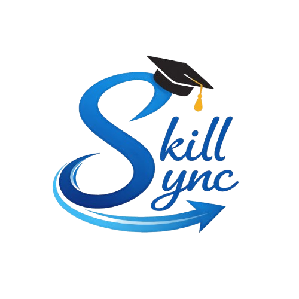

<div align="center">
  
  <h1>SkillSync - Mentor Learning Platform</h1>
  <p><i>A production-grade, highly scalable platform for mentorship programming and session management.</i></p>
</div>

---

## 📖 Table of Contents
- [About the Project](#about-the-project)
- [Key Features](#key-features)
- [System Architecture](#system-architecture)
  - [Frontend Layer](#frontend-layer)
  - [Backend Microservices Layer](#backend-microservices-layer)
  - [Infrastructure & Data](#infrastructure--data)
- [Technology Stack](#technology-stack)
- [Deployment & DevOps](#deployment--devops)
- [Observability & Monitoring](#observability--monitoring)
- [Getting Started](#getting-started)

---

## 🚀 About the Project
**SkillSync** is a comprehensive, production-ready platform designed to bridge the gap between eager learners and experienced mentors. It features a robust role-based ecosystem supporting Learners, Mentors, and Administrators.

The system is built to demonstrate enterprise-level architecture: handling everything from secure end-to-end product flows (authentication, mentor discovery, session lifecycle, profile management, and payments) to resilient back-end operations (microservices, event-driven messaging, distributed caching, and container orchestration).

---

## ✨ Key Features
- **Role-Based Workflows**: Distinct functionalities separated cleanly across Learners, Mentors, and Admins.
- **Session Lifecycle Management**: Complete handling of request workflows, scheduling, real-time accept/reject capabilities, and post-session review systems.
- **Advanced Security**: JWT-based authentication via an API Gateway, OTP verification workflows, and secure password-reset mechanisms.
- **High-Performance Caching**: Incorporates CQRS (Command Query Responsibility Segregation) design alongside Redis distributed caching strategies.
- **Fully Asynchronous**: Employs RabbitMQ for decoupled event-driven data streaming (e.g., mail processing, audit logging).

---

## 🏛 System Architecture

### Frontend Layer
Engineered for scale and performance, the client-side uses a modern Single Page Application (SPA) approach.
- **State Management**: Redux Toolkit is utilized for global client state (auth tokens, themes, profiles), while React Query gracefully handles complex server state, automatic retries, and API caching.
- **Security Intercepts**: Axios interceptors ensure secure communications, automatically injecting and refreshing JWTs without interrupting UX.
- **Componentized Routing**: Route guards rigorously enforce user roles avoiding unauthorized access to specialized zones.

### Backend Microservices Layer
The backend is composed of **8 independent domain & infrastructure services** built with Java and Spring Boot.
- **API Gateway**: Acts as a reverse-proxy and the sole entry point to the system, facilitating edge-level security, auth validation, and load balancing.
- **Service Discovery** (Eureka Server): Enables dynamic auto-registration and discovery of individual microservices.
- **Centralized Configuration** (Spring Cloud Config): Supplies runtime configurations directly from a centralized, secure repository.

### Infrastructure & Data
- **Event-Driven Messaging**: RabbitMQ broker allows services to communicate asynchronously without hard dependencies.
- **Data Stores**:
  - **PostgreSQL**: Implemented for durable, relation-based data with strict ACID compliance.
  - **Redis**: Functions to store ephemeral session data, frequent lookup tables, and caching layers to minimize database loads.

---

## 🛠 Technology Stack

| Category            | Technologies |
| :---                | :--- |
| **Frontend**        | React 18, TypeScript, Redux Toolkit, React Query, TailwindCSS ( assumed ) |
| **Backend Core**    | Java 17+, Spring Boot, Spring Cloud (Gateway, Eureka, Config) |
| **Databases**       | PostgreSQL, Redis |
| **Message Broker**  | RabbitMQ |
| **Security**        | JWT (JSON Web Tokens), OAuth2 |
| **DevOps / Infra**  | Docker, Docker Compose, AWS EC2 |
| **Observability**   | Zipkin, Prometheus, Grafana, Loki |

---

## ☁️ Deployment & DevOps
The application is purely cloud-native and environment-agnostic via robust containerization practices.
- **Dockerization**: Every service (including React builds, Spring jars, and databases) possesses its own isolated `Dockerfile`.
- **Orchestration**: System lifecycle is maintained entirely through `docker-compose`, simplifying the multi-service build/up pipeline. 
- **Production CI/CD**: Standardized build flows push immutable images to the Docker Hub registry, followed by secure remote scripts that deploy rolling updates onto the AWS EC2 instance.

---

## 🔍 Observability & Monitoring
Keeping a distributed architecture healthy requires top-tier observability. SkillSync implements a modern observability triad:
- **Metrics (Prometheus & Grafana)**: Tracks system vitals, JVM performance, connection pools, and real-time response latency through comprehensive dashboards.
- **Distributed Tracing (Zipkin)**: Traces every unique HTTP request across the API Gateway down to exactly which microservices handled it, making bottleneck identification effortless.
- **Logging (Loki)**: Aggregates logs from all containerized services into a central hub, allowing operators to run queries spanning the entire cluster instantly.

---

## 💻 Getting Started

### Prerequisites
- [Docker & Docker Compose](https://www.docker.com/products/docker-desktop)
- Java 17+ (Local development)
- Node.js 18+ (Local frontend development)

### Local Deployment using Docker Compose
The easiest way to spin up the entire ecosystem is through the root Docker Compose file.

```bash
# 1. Clone the repository
git clone https://github.com/UDAYASRIBASAWOJU/SkillSync-FullStack.git
cd SkillSync

# 2. Pull the latest images from Docker Hub (if using pre-built images)
docker compose pull

# 3. Spin up the infrastructure and services in detached mode
docker compose up -d

# 4. Verify everything is running
docker compose ps
```

*Note: Once running, the frontend is typically accessible at `http://localhost:3000` (or `http://localhost:80` for prod), and the backend Gateway is accessible at its mapped port.*

---
<div align="center">
  <i>Built with ❤️ for scalable education.</i>
</div>
